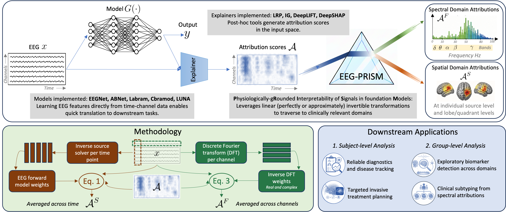

#EEG-PRISM: Physiologically-Grounded Interpretability of EEG Signals in Foundation Models

Manuscript under review

  

# Abstract
EEG foundation models show strong performance and rapid adaptability by directly processing EEG time-series. However, even with post-hoc interpretability, their black-box nature persists, as time–channel attributions poorly align with clinical needs. We therefore aim to extend interpretability to clinically meaningful spectral and spatial domains without modifying the underlying model and with minimal recomputation. EG-PRISM leverages linear transformations and established attribution backpropagation rules to map time-channel scores into alternative domains. We derive mappings to the frequency domain via an invertible DFT and to the source domain via an approximately invertible EEG generation model. We evaluate EEG-PRISM in simulated and real data, assessing recovery of ground-truth phenomena across domains with five foundation models and four explainers. In simulation, EEG-PRISM achieves near-perfect spectral recovery and 69.2\% spatial accuracy. In TUSZ, delta–theta activity is most salient, aligning with clinical annotations, with 50\% accuracy in identifying one of five onset zones. In autism, delta–alpha biomarkers localize to frontal and temporal regions tied to cognitive and emotional processing. EEG-PRISM is a theoretically-grounded post-hoc attribution method with accurate mapping across spectral and spatial domains without modifying the model. It supports window-level analysis of transient events (e.g., seizures) and group-level identification of clinically relevant biomarkers (e.g., autism), advancing interpretable EEG foundation models. This work enables physiologically-grounded interpretation of EEG foundation models by deriving  attributions in spectral and spatial domains, guaranteeing  fidelity and supporting clinically relevant insights such as event localization and biomarker identification.

